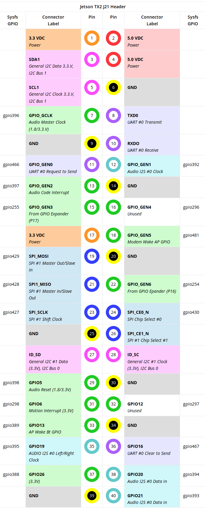

# How to use the GPIO on the Jetson TX2 
## McMaster Mars Rover Team

## Setup 

More detailed steps can be found in the jetson-gpio python library

Create a new user group called gpio

    sudo groupadd -f -r gpio

Add yourself to the new group

    sudo usermod -a -G gpio {username}

Activate the rules for GPIO access 99-gpio.rules

    sudo cp 99-gpio.rules /etc/udev/rules.d/

Reboot or reload the udev rules

    sudo udevadm control --reload-rules && sudo udevadm trigger

You should not be able to access the GPIO pins to try sample the sample python code 

## Using Jetson GPIO Python Library

Documentation for the python libraray can be found here:

https://github.com/NVIDIA/jetson-gpio

The repository includes instructions for installing and setting up GPIO on the Jetson TX2

## Using SYSFS interface

For basic interaction with GPIO without libraries or for tesing we can choose to use SYSYFS to interact with the GPIO pins

The basic steps are:

* Export the pin
* Set the direction of the pin
* Set the data on the pin
* Unexport the pin when not in use

### How to know the pins I want?

Unlike the python library for the Jetson, we cannot simply use the pin number to interact with a specific pin on the GPIO expansion

Instead we can use:

https://www.jetsonhacks.com/nvidia-jetson-tx2-j21-header-pinout/

where the following image is found:

The numbers at the end of 'gpio' are the sysfs mapping to that specific pin. So we use that as X in the Step-by-Step approach below 

You can also find the Jetson-TX2-GPIO-Mapping.xlsx where we can find each the number we need to use for each pin under the column name 'Linux GPIO'. 

### Step by Step

The directory to find the export and unexport file are located at `/sys/class/gpio/`

If we want to export pin X, then we may simply write in the command line

    echo X > /sys/class/gpio/export

This means that if we `ls /sys/class` we should see `gpioX` available

To set the pin as an input or output we need to write into the direction file available at `/sys/class/gpioX/`.

If we wanted to set the pin as an input the command in the terminal

    echo in > /sys/class/gpio/gpioX/direction

Or if we wanted to set it as an output we may also use the command

    echo out > /sys/class/gpio/gpioX/direction

If we have the pin setup as an **input** we can simply `cat` the value file

    cat /sys/class/gpio/gpioX/value

Likewise if we had the pin as an output we can write to the file a 1 or 0

    echo 1 > /sys/class/gpio/gpioX/value

Now when we are done with the pin, we need to make sure to unexport the pin

    echo X > /sys/class/gpio/unexport

The python and C/C++ libraries simply perform these file writes and reads to make using the GPIO pins easier.
