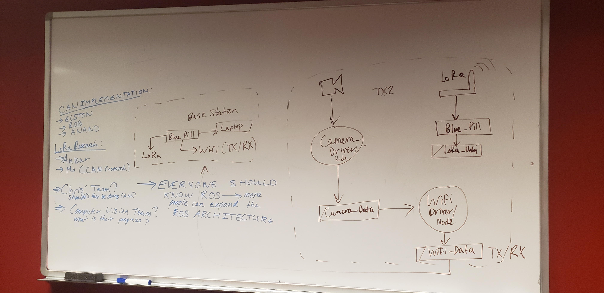

# Meeting Notes (Feb 27, 2020)

Summary: Updates regarding the LoRa Modules and ROS outline

## Updates

* We have bought 4 SX1268 LoRa modules currently in shipping and we also ordered ~4 STM32F103 Blue Pills. These microcontrollers will be modified to use the Arduino bootloader and effectively allow us to program the board exactly like an Arduino use Arduino Libraries. The LoRa modules will then be soldered onto the breakout boards designed by Anand to be integrated with the STM32F103.

* The reason why we decided to choose the STM32F103 over an Arduino Nano is beacuse it is simply better in terms of price AND performance. The STM32F103 utilizes the Cortex M3 which uses 32 bits, has more flash memory, 72 MHz max, SPI ports, lower cost, and is also more fun to program. The Arduino Nano is only 8 bits, 16 MHz, provides less I/O, and is generally not worth the price.

* The reason why we decided to choose the SX1268 is due to support for 850-930 MHz (required for some competitions), less power, and we have a team member with experience using this module.

* Our future work depends heavily on ROS as the main software team will need to integrate all nodes together. So while the LoRa boards are not ready yet, the majority of our team will be focusing on CAN and ROS.

## Meeting

### ROS (Huge Credits to Robert for the Presentation)

* What is ROS?

ROS(Robot Operating System) is designed to be a middleware used for robotics applications. The term middleware means that it allows us to interact with hardware from a higher level while providing additional support for managing data movement in large systems and has packages for specific applications.

* How do we use ROS?

Once the master instance of ROS is running, we are to create individual nodes for specific tasks. These nodes can be thought of as simple functions/classes to move data from one place to another. An example would be a node that acts as a driver to interact with some sensor. Once the node is able to interact with the sensor, it should be able to send data over to other nodes that require the sensor data. This driver node will publish the data it has to a "topic" and other devices can subscribe to listen to this topic. The *topic* can be thought of as a container where nodes who publish data will push data towards this container and nodes who subscribe can listen to data inside the container. A node that publishes code to a topic is called a *publisher* and a node that subscribes to a topic to listen for specific data is called a *subscriber*. A node also can be a publisher and subscriber if it needs to take in data for processing from one topic and pushes the processed data out towards another topic.

ROS also has its own powerful packages to interface with a lot of hardware and due to its open source nature we can find an abundance of implementations online.

* Why should we use it?

As we decide to grow this project, we need to keep track of where, why, and how the data moves. ROS makes this process easy by providing graphs of nodes and topics to easily view the data flow. By utilizing ROS we are able to ensure the software development can be a lot more mobile in the long run, and would save a lot of time when debugging. Since nodes do not directly speak to other nodes, we can ensure that the code we write would be more robust and cleaner over time. An example where this would be useful: if one day a sensor needed to be upgraded or replaced with another sensor where the driver code is not compatible. In ROS, since nodes only care about the content inside the topic, we can simply remove the old driver node and start publishing from a new node. In short, this would make refactoring multiple files and systems a thing of the past and would allow for us to not worry as much about breaking code from dependencies. Additionally we can also easily view topics nodes are listening and publishing towards making it easy to see dependencies of nodes i.e. where and why it is used. Lastly, it also makes debugging easier as we can probe individual topics and see the data during runtime.

ROS would significantly help the long term goals of all sub-teams.

* ROS seems more software than electrical?

We are simply writing drivers to be used by the software team. Since we are able to directly integrate these drives as nodes using ROS, it makes it easier during integration as the software teams can directly use our implementation rather than rewriting or not even using the drivers we build.  

#### ROS Brief Overview

A rough outline is drawn above where we view the expected implementation of ROS (Again huge shoutout to Robert for the cute rover diagram).

To summarize the image:

*For Lora on the Rover:*

* LoRa module connected to STM32F103
* STM32F103 utilizes a LoRa driver based on RadioHead to send and receive information
* The microcontroller will interact with the the Jetson TX2 via GPIO(or other means)
* A node listening for LoRa data will place the data into a topic
* A node sending data will move data to the microcontroller to be sent via the lora module

*For CAN on the Rover:*

Since we already have socketCAN already available in a ROS package ros_canOpen, the plan assumes we are able to get such modules working

* A single node will be created that will be sending data over the CAN ports
* More may be created to organize this data or depending on the implementation required by ros_canOpen

*For WiFi:*

* Not a priority

### OpenCAN

Since we have the CAN transceiver hooked up the build space we will be trying to play with/figure out how to use various libraries such as [CANOpen for Python](https://canopen.readthedocs.io/en/latest/). Once we figure out how to implement a simpler library with a decent amount of documentation, then we can try and tackle implementing [ROS CANOpen](http://wiki.ros.org/ros_canopen).

CAN is definitely more heavy in terms of theory and technical details, but there is a decent amount of research links provided in the CAN docs for anyone looking to get up to speed regarding the implementation and libraries. There are also research presentations available upon request (Slack).

### LoRa

We currently have team members researching the implementation of LoRa and will be providing a presentation at the next group meeting (in 2 weeks time). If inquiries need to be made and if you need additional help understanding the theory/usage then you always have our local expert Anand.

